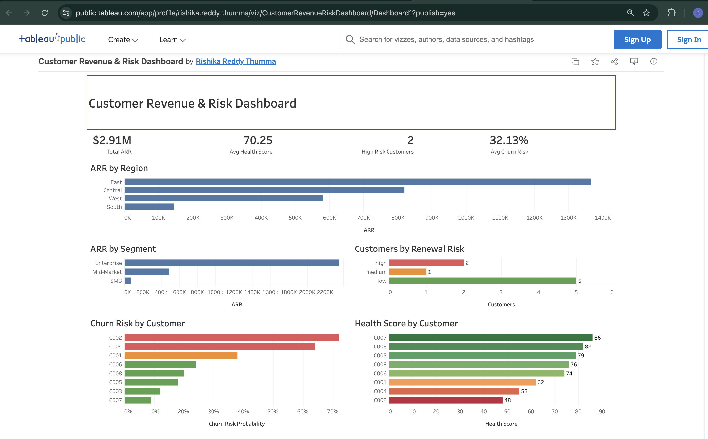

# Enterprise Customer Revenue & Risk Platform

An end-to-end customer revenue and risk analytics platform built with AWS S3, Snowflake, dbt, Apache Airflow, GitHub Actions, and Tableau.

The platform ingests source data into Snowflake, transforms it through layered dbt models, validates data quality, supports incremental change processing, and publishes analytics-ready datasets for customer revenue, churn risk, health score, and renewal analysis.

---

## Live Dashboard

**Customer Revenue & Risk Dashboard**  
https://public.tableau.com/app/profile/rishika.reddy.thumma/viz/CustomerRevenueRiskDashboard/Dashboard1



Current dashboard metrics:

| Metric | Value |
|---|---:|
| Total ARR | $2.91M |
| Average Health Score | 70.25 |
| High-Risk Customers | 2 |
| Average Churn Risk | 32.13% |

The dashboard includes:

- ARR by region
- ARR by customer segment
- Customers by renewal risk
- Churn risk by customer
- Health score by customer

---

## Architecture

```text
Source Data
    |
    v
AWS S3
    |
    v
Snowpipe
    |
    v
Snowflake RAW
    |
    v
dbt STAGING
    |
    v
dbt CORE
    |
    v
Analytics MARTS
    |
    +----------------------+
    |                      |
    v                      v
Tableau              Snowflake Streams
Dashboard                  |
                           v
                      Snowflake Tasks
                           |
                           v
                     Audit / CDC Data
```

Supporting components:

```text
Apache Airflow  -> Pipeline orchestration
dbt             -> Transformation and testing
GitHub Actions  -> CI/CD validation
Snowflake       -> Storage, processing, security
Tableau         -> Analytics and reporting
```

---

## Tech Stack

| Area | Technology |
|---|---|
| Cloud Storage | AWS S3 |
| Data Warehouse | Snowflake |
| Data Ingestion | Snowpipe |
| Transformation | dbt |
| Orchestration | Apache Airflow |
| Incremental Processing | Snowflake Streams & Tasks |
| Data Quality | dbt Tests |
| CI/CD | GitHub Actions |
| Security | Snowflake RBAC, Secure Views |
| Visualization | Tableau |
| Languages | SQL, Python |

---

## Data Platform Design

The warehouse is organized into four logical layers:

```text
RAW
 |
 v
STAGING
 |
 v
CORE
 |
 v
MARTS
```

### RAW

Stores source data close to its original structure.

### STAGING

Handles:

- Column standardization
- Data type conversion
- Basic cleanup
- Field preparation for downstream joins

### CORE

Contains reusable business logic around:

- Customers
- Revenue
- ARR
- Customer segments
- Health scores
- Churn risk
- Renewal risk

### MARTS

Contains analytics-ready datasets used by Tableau.

This separation keeps ingestion, transformation, business logic, and reporting concerns independent.

---

## Data Ingestion

Source files are stored in AWS S3 and loaded into Snowflake with Snowpipe.

```text
Source Data
    |
    v
AWS S3
    |
    v
Snowpipe
    |
    v
Snowflake RAW Tables
```

The raw layer is kept separate so the original source data remains available before business transformations are applied.

---

## dbt Transformation Layer

dbt manages the SQL transformation workflow:

```text
Sources
   |
   v
Staging Models
   |
   v
Core Models
   |
   v
Analytics Marts
```

Breaking transformations into modular models makes the logic easier to test, reuse, and maintain.

---

## Data Quality

dbt tests validate important fields and model relationships.

Current checks include:

```text
unique
not_null
accepted_values
relationships
```

These tests help detect:

- Duplicate customer IDs
- Missing required values
- Unexpected risk categories
- Invalid relationships
- Transformation issues

---

## Historical Customer Tracking

The project includes Slowly Changing Dimension Type 2 concepts for tracking customer changes over time.

```text
Existing Customer Record
          |
          v
Customer Data Changes
          |
          v
Previous Version Retained
          |
          v
New Version Created
```

This allows both current-state and historical customer analysis.

---

## Incremental Processing with Snowflake Streams & Tasks

Snowflake Streams capture changes such as:

- Inserts
- Updates
- Deletes

Snowflake Tasks then process those changes without requiring a full-table reload.

```text
Source Table
     |
     v
Snowflake Stream
     |
     v
Snowflake Task
     |
     v
Audit / Downstream Table
```

This provides a simple incremental-processing pattern inside the warehouse.

---

## Airflow Orchestration

Apache Airflow coordinates the major pipeline stages.

```text
Start
  |
  v
Load / Validate Data
  |
  v
Run dbt Models
  |
  v
Run dbt Tests
  |
  v
Build Analytics Models
  |
  v
Reporting Data Ready
```

Airflow makes dependencies explicit and ensures downstream reporting models are only considered ready after transformation and validation steps complete successfully.

---

## Security & Access Control

The project includes Snowflake role-based access control concepts and secure views.

```text
Raw / Internal Data
        |
        v
Transformation Layer
        |
        v
Controlled Reporting View
        |
        v
Analytics User
```

This keeps reporting access separate from internal warehouse objects.

---

## CI/CD

GitHub Actions provides automated repository checks on pushes and pull requests.

```text
Code Change
    |
    v
Git Push / Pull Request
    |
    v
GitHub Actions
    |
    +----> Validate
    |
    +----> Run Checks
    |
    +----> Test dbt Changes
    |
    v
Validated Change
```

This adds repeatable validation before changes are merged.

---

## Dashboard Insights

The Tableau reporting layer focuses on customer revenue and risk.

### ARR

Total Annual Recurring Revenue:

```text
$2.91M
```

### Customer Health

Average health score:

```text
70.25
```

### High-Risk Customers

Current high-risk customers:

```text
2
```

### Churn Risk

Average churn risk:

```text
32.13%
```

The dashboard also shows revenue distribution by region and segment, renewal-risk categories, churn-risk ranking, and customer-level health scores.

---

## Repository Structure

```text
enterprise-customer-revenue-platform/
├── .github/
│   └── workflows/
├── airflow/
├── customer_revenue_dbt/
├── data/
├── docs/
│   └── customer-revenue-risk-dashboard.png
├── scripts/
├── snowflake/
├── tests/
├── .env.example
├── .gitignore
├── README.md
└── requirements.txt
```

---

## Engineering Highlights

This project demonstrates:

- Cloud data ingestion with AWS S3 and Snowpipe
- Layered Snowflake warehouse design
- Modular dbt transformation models
- Automated data-quality testing
- SCD Type 2 concepts
- Incremental processing with Streams and Tasks
- Airflow orchestration
- GitHub Actions CI/CD
- Snowflake RBAC and secure views
- Business-facing Tableau analytics

---

## Future Improvements

- Automated Tableau refresh
- Pipeline monitoring and alerting
- Additional dbt tests
- Revenue forecasting
- Customer lifetime value analysis
- Predictive churn modeling
- Data observability
- Infrastructure automation
- Snowflake cost monitoring
